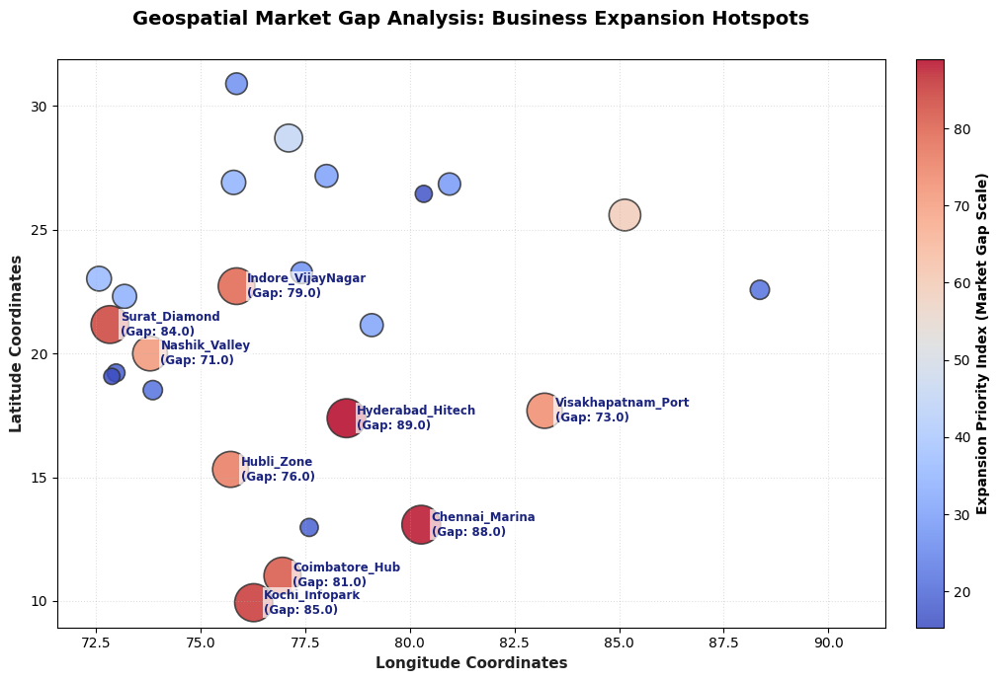

# GEOSPATIAL DATA ANALYSIS & MARKET EXPANSION

## OVERVIEW
The goal of this assignment is to analyze geographical data streams, map regional sales demand against active physical locations, and isolate high-opportunity market expansion zones using custom coordinate priority indexing.

## VISUAL DATA INSIGHTS
### 1. Geospatial Market Gap Index Mapping (Coolwarm Distribution Scale)

## CORE ACTIONS TAKEN
* **Spatial Coordinate Integration**: Formatted geographic indicators (`latitude`, `longitude`) into tabular vectors to calculate coordinate spatial spreads across 25 major urban business hubs.
* **Expansion Priority Formulations**: Designed an algorithmic Market Gap Score measuring regional demand intensity directly against existing network densities to pinpoint unserved sectors.
* **Visual Congestion Optimization**: Engineered a text-shifting spacing matrix with customized text boundary masks to insulate labels and eliminate visual crowding on the dashboard.
* **Geospatial Hotspots Plotting**: Implemented an automated Python visualization script utilizing balanced color mapping scales to cleanly highlight high-priority expansion areas.

## OPERATIONAL MATRIX

| Data Element / Tool | Functional Purpose | Technical Implementation |
| :--- | :--- | :--- |
| **Market Gap Indexing** | Ranks high demand vs low presence | `df['sales_demand_score'] / (df['existing_stores_count'] + 1)` |
| **Label Collision Shift** | Eliminates text visual crowding | Shifting coordinates with custom offsets |
| **Opportunity Filter** | Extracts premium expansion targets | Chronological indexing priority sorting |

## PROJECT ASSETS
* `location_dataset.csv`: Regional coordinate data logs and store density spreadsheet.
* `spatial_analysis.py`: Main Python spatial-filtering and geographical visualization script.
* `expansion_hotspots_map.png`: Visual market gap geospatial coordinate map image asset.
* `README.md`: Project documentation blueprint and status file.

## METHODOLOGY REFERENCE
To construct the geospatial tracking models and balance the color palettes, reference strategies were adapted from industry frameworks.
* **Spatial Data Analysis Framework**: [What Is Spatial Data? A Beginner’s Guide](https://youtu.be)

**Project Completed By:** HARINI P  
**Role:** Data Analytics Intern  
**Project Track:** Task 4 Evaluation

